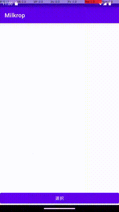

# [WIP]

## Milcrop

this is a library to support

- trimming
- imageview with gesture

for android

## Roadmap

[x] Gesture supported ImageView  
[ ] Basic CropView  
[ ] Extended CropView ( which means crop, write text, drawing....)

## GestureImageView

supports 
- double tap
- translation
- rotation